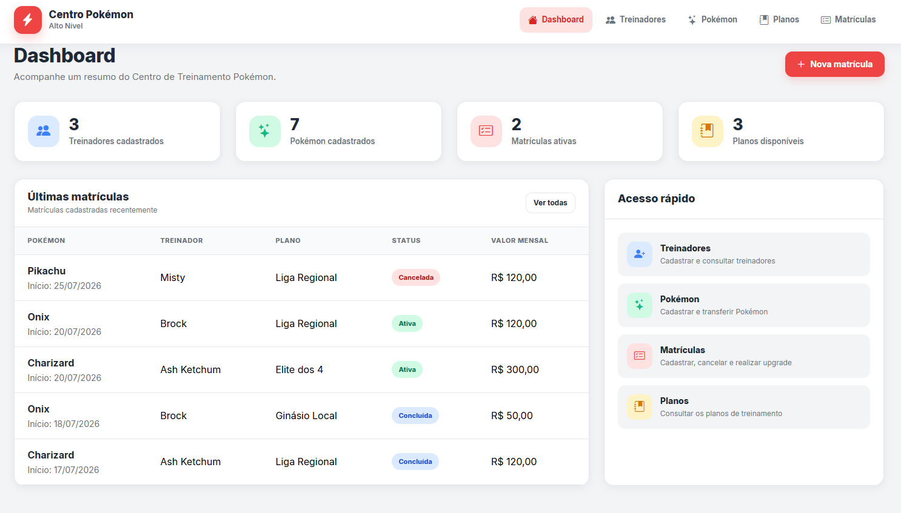

# Centro de Treinamento Pokémon — Alto Nível

 //Foto geral do projeto FrontEnd.

Aplicação desenvolvida como parte do desafio técnico para a vaga de Desenvolvedor(a) Júnior.

O sistema permite gerenciar Treinadores, Pokémon e Matrículas em planos mensais de treinamento, incluindo cancelamento de matrícula, upgrade proporcional entre planos e transferência de Pokémon entre treinadores.

O enunciado original do desafio encontra-se em **DESAFIO.md**.

## Sumário

- [Tecnologias Utilizadas](#tecnologias-utilizadas)
- [Estrutura do Projeto](#estrutura-do-projeto)
- [Funcionalidades](#funcionalidades)
- [Regras de Negócio Implementadas](#regras-de-negócio-implementadas)
- [Banco de Dados](#banco-de-dados)
- [Como Executar o Banco de Dados](#como-executar-o-banco-de-dados)
- [Como Executar o Backend](#como-executar-o-backend)
- [Como Executar o Frontend](#como-executar-o-frontend)
- [Fluxo para Testes](#fluxo-para-testes)
- [Tratamento de Erros](#tratamento-de-erros)
- [Decisões Técnicas](#decisões-técnicas)
- [Melhorias Futuras](#melhorias-futuras)
- [Uso de Inteligência Artificial](#uso-de-inteligência-artificial)

---

# Tecnologias Utilizadas

## Backend

- .NET 8
- ASP.NET Core Web API
- Entity Framework Core 8
- SQL Server
- Swagger / OpenAPI

## Frontend

- Angular
- TypeScript
- HTML5
- CSS3

## Banco de Dados

- SQL Server
- SQL puro para criação das tabelas e consulta de MRR

---

# Estrutura do Projeto

```text
CentroTreinamentoPokemon/
│
├── backend/
│
├── frontend/
│
├── database/
│   ├── schema.sql
│   ├── dados-teste.sql
│   └── consulta-mrr.sql
│
├── DESAFIO.md
└── README.md
```

---

# Funcionalidades

O sistema possui as seguintes funcionalidades:

- Cadastro de Treinadores.
- Cadastro de Pokémon.
- Cadastro de Matrículas.
- Listagem de Matrículas.
- Busca por nome do Pokémon.
- Busca por nome do Treinador.
- Filtro por status da matrícula.
- Cancelamento de matrícula.
- Simulação de upgrade entre planos.
- Confirmação de upgrade.
- Transferência de Pokémon entre treinadores.
- Tratamento global de erros da API.

---

# Regras de Negócio Implementadas

## R1 — Matrícula única ativa

Um Pokémon pode possuir apenas uma matrícula ativa.

Antes da criação de uma nova matrícula, a API verifica se já existe uma matrícula ativa para o Pokémon.

Caso exista, a operação é bloqueada e uma mensagem amigável é retornada ao frontend.

---

## R2 — Upgrade com cálculo proporcional

Foi implementado um fluxo composto por dois endpoints:

- Simulação do upgrade;
- Confirmação do upgrade.

Na simulação, nenhuma alteração é realizada no banco de dados.

Na confirmação:

- a matrícula atual é concluída;
- uma nova matrícula é criada;
- o histórico da matrícula anterior é preservado.

O cálculo da primeira cobrança considera um ciclo mensal de 30 dias.

A primeira cobrança é calculada pela seguinte fórmula:

```
Primeira cobrança =
Valor proporcional do novo plano
-
Crédito proporcional do plano atual
```

Também foram implementadas as seguintes validações:

- não é permitido upgrade para o mesmo plano;
- downgrade não é permitido;
- apenas matrículas ativas podem receber upgrade.

---

## R3 — Plano Elite dos 4

Somente Pokémon com nível igual ou superior a 50 podem:

- ser matriculados no plano Elite dos 4;
- realizar upgrade para o plano Elite dos 4.

---

## R4 — Matrículas Canceladas

Foi adotada a premissa de que matrículas canceladas permanecem armazenadas para manter o histórico do sistema.

Ao cancelar uma matrícula:

- o status é alterado para Cancelada;
- a data de encerramento é registrada.

A consulta de Receita Mensal Recorrente (MRR) considera apenas matrículas com status Ativa.

---

## R5 — Transferência de Pokémon

Foi adotada a premissa de que as matrículas pertencem ao Pokémon e não diretamente ao Treinador.

Ao transferir um Pokémon:

- o treinador responsável é alterado;
- as matrículas existentes permanecem;
- histórico, valores e planos são preservados.

Não é permitido transferir um Pokémon para o treinador que já é seu proprietário.

---

# Banco de Dados

O banco de dados utilizado na aplicação é o **SQL Server**.

Na pasta **database** encontram-se os scripts necessários para criação da estrutura do banco e para execução da consulta de Receita Mensal Recorrente (MRR).

## Arquivos disponíveis

### schema.sql

Responsável pela criação de toda a estrutura do banco de dados, incluindo:

- Banco de dados;
- Tabelas;
- Relacionamentos;
- Chaves primárias;
- Chaves estrangeiras;
- Restrições.

### dados-teste.sql

Script opcional contendo dados de exemplo para facilitar os testes da aplicação.

Caso preferir, todos os dados também podem ser cadastrados diretamente através da API ou da interface da aplicação.

### consulta-mrr.sql

Consulta SQL responsável pelo cálculo da Receita Mensal Recorrente (MRR), agrupando os valores por plano de treinamento e apresentando também uma linha com o total geral.

A consulta considera apenas matrículas com status **Ativa**.

---

# Como Executar o Banco de Dados

## Pré-requisitos

É necessário possuir uma instância do **SQL Server** instalada.

O projeto foi desenvolvido utilizando a instância:

```text
localhost\SQLEXPRESS
```

Os scripts encontram-se na pasta:

```text
database/
```

## 1. Criar o banco de dados

Abra o SQL Server Management Studio (SSMS), Azure Data Studio ou outra ferramenta compatível e conecte-se à instância:

```text
localhost\SQLEXPRESS
```

Em seguida execute o arquivo:

```text
database/schema.sql
```

Esse script criará toda a estrutura necessária para funcionamento da aplicação.

## 2. Inserir dados para teste

Opcionalmente execute o arquivo:

```text
database/dados-teste.sql
```

Esse script insere registros para facilitar a validação das funcionalidades da aplicação.

## 3. Configurar a conexão

A API utiliza a seguinte configuração localizada em:

```text
backend/CentroTreinamentoPokemon.Api/appsettings.json
```

```json
{
  "ConnectionStrings": {
    "DefaultConnection": "Server=localhost\\SQLEXPRESS;Database=CentroTreinamentoPokemon;Trusted_Connection=True;TrustServerCertificate=True;"
  }
}
```

Caso sua instância do SQL Server possua outro nome, basta alterar o valor do campo **Server**.

## 4. Executar a consulta MRR

Após possuir matrículas cadastradas, execute:

```text
database/consulta-mrr.sql
```

A consulta retornará:

- Receita Mensal Recorrente agrupada por plano;
- Apenas matrículas com status **Ativa**;
- Linha contendo o total geral.

---

# Como Executar o Backend

Abra um terminal na pasta do backend.

```bash
cd backend
```

Restaure as dependências do projeto.

```bash
dotnet restore
```

Compile a solução.

```bash
dotnet build
```

Execute a API.

```bash
dotnet run
```

Após iniciar a aplicação, o terminal exibirá os endereços utilizados.

A documentação Swagger poderá ser acessada em um endereço semelhante a:

```text
https://localhost:xxxx/swagger
```

A porta poderá variar conforme a configuração local.

---

# Como Executar o Frontend

Abra um terminal na pasta do frontend.

```bash
cd frontend/frontend
```

Instale as dependências.

```bash
npm install
```

Execute a aplicação.

```bash
npm start
```

ou

```bash
ng serve
```

Após iniciar, a aplicação estará disponível em:

```text
http://localhost:4200
```

O frontend consome a API desenvolvida no backend, portanto ambos devem estar em execução.

---

# Fluxo para Testes

## Cadastro

1. Cadastre um treinador.
2. Cadastre um Pokémon.
3. Cadastre uma matrícula.

## Validação da Regra R1

Tente cadastrar uma segunda matrícula ativa para o mesmo Pokémon.

Resultado esperado:

- A operação deve ser bloqueada.
- A API retorna uma mensagem informando que o Pokémon já possui uma matrícula ativa.

## Validação da Regra R2

1. Simule um upgrade.
2. Verifique o valor da primeira cobrança.
3. Confirme o upgrade.

Resultado esperado:

- Matrícula anterior concluída.
- Nova matrícula criada.
- Valor proporcional calculado corretamente.

## Validação da Regra R3

Tente matricular um Pokémon com nível inferior a 50 no plano Elite dos 4.

Resultado esperado:

A operação deverá ser rejeitada.

## Validação da Regra R4

Cancele uma matrícula.

Execute novamente o arquivo:

```text
database/consulta-mrr.sql
```

Resultado esperado:

A matrícula cancelada não deverá compor o cálculo da Receita Mensal Recorrente.

## Validação da Regra R5

Transfira um Pokémon para outro treinador.

Resultado esperado:

- O treinador será alterado.
- As matrículas permanecerão vinculadas ao Pokémon.
- O histórico será preservado.

---

# Tratamento de Erros

A aplicação possui um middleware global responsável pelo tratamento das exceções.

As regras de negócio retornam:

```text
HTTP 400 - Bad Request
```

Exemplo:

```json
{
  "mensagem": "O Pokémon já possui uma matrícula ativa."
}
```

Erros inesperados retornam:

```text
HTTP 500 - Internal Server Error
```

com uma mensagem genérica, evitando a exposição de detalhes internos da aplicação.

---

# Decisões Técnicas

Durante o desenvolvimento foram adotadas as seguintes decisões:

- Arquitetura em camadas (Domain, Application, Infrastructure, API e DataTransfer);
- Separação das responsabilidades entre as camadas;
- Regras de negócio implementadas nas entidades de domínio;
- Utilização do padrão Repository para acesso aos dados;
- Utilização do padrão Unit of Work para persistência;
- Middleware para tratamento global de exceções;
- Entity Framework Core para acesso ao banco de dados;
- SQL puro para implementação da consulta de Receita Mensal Recorrente (MRR);
- Preservação do histórico das matrículas durante cancelamentos e upgrades.

---

# Melhorias Futuras

Caso houvesse mais tempo para evolução do projeto, poderiam ser implementadas as seguintes melhorias:

- Testes unitários;
- Testes de integração;
- Paginação das listagens;
- Autenticação e autorização;
- Logs estruturados;
- Containerização utilizando Docker;
- Pipeline de Integração Contínua (CI/CD);
- Melhorias na interface do usuário;
- Validações adicionais no frontend;
- Documentação mais detalhada da API.

---

# Uso de Inteligência Artificial

Durante o desenvolvimento foi utilizada a ferramenta **ChatGPT** como apoio ao processo de desenvolvimento.

A Inteligência Artificial foi utilizada para:

- esclarecer dúvidas relacionadas ao .NET, Angular e Entity Framework Core;
- revisar a arquitetura e organização das camadas da aplicação;
- discutir regras de negócio e cenários de validação;
- auxiliar na implementação e revisão do cálculo proporcional de upgrade;
- auxiliar na interpretação de mensagens de erro durante o desenvolvimento;
- revisar trechos de código, sugerindo melhorias e boas práticas;
- auxiliar na elaboração desta documentação.

Todas as sugestões fornecidas foram analisadas, adaptadas à estrutura do projeto e testadas antes de serem incorporadas.

A utilização da Inteligência Artificial ocorreu apenas como ferramenta de apoio ao desenvolvimento, permanecendo sob minha responsabilidade o entendimento das soluções implementadas e as decisões técnicas adotadas.

---

# Autora

**Ana Rita Lopes de Almeida Bastos**

Desenvolvedora Full Stack .NET
